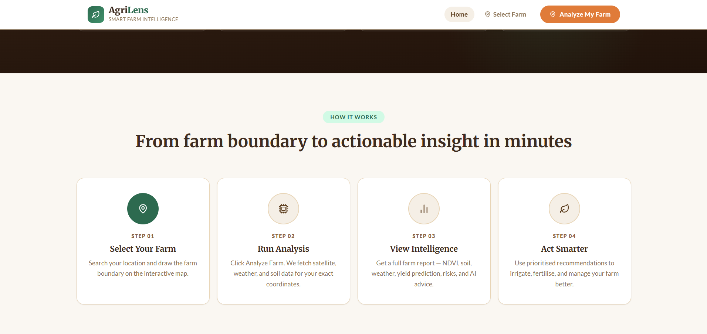
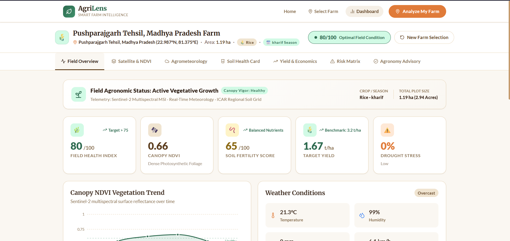
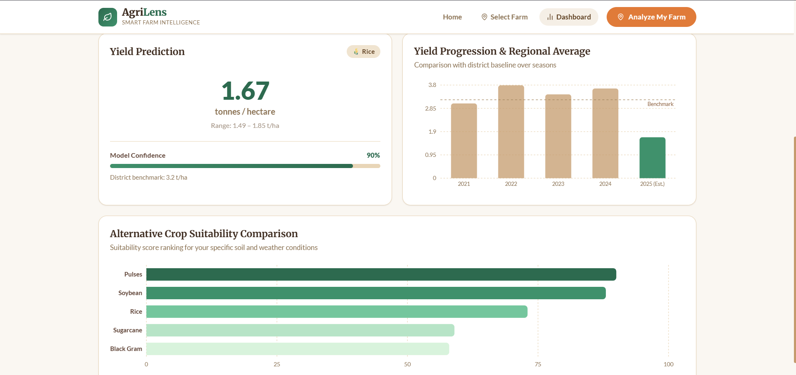
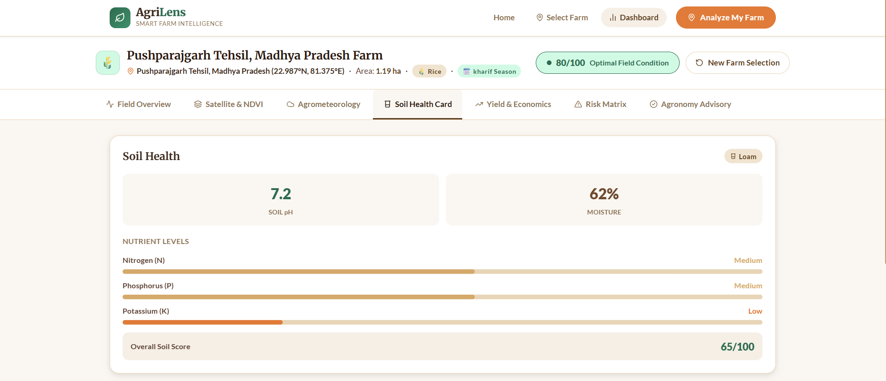
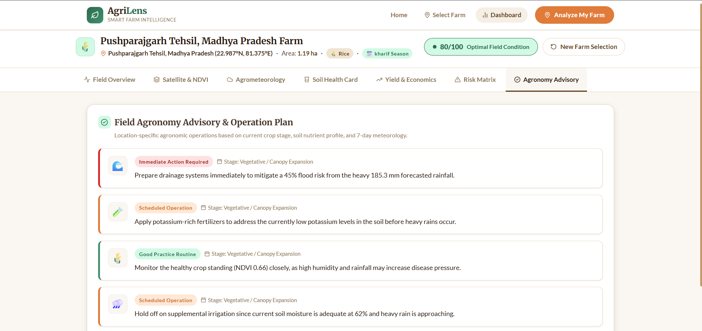

# 🌾 AgriLens — Smart Farm Intelligence Platform

[](https://www.python.org/)
[](https://fastapi.tiangolo.com/)
[](https://react.dev/)
[](https://vitejs.dev/)
[](https://leafletjs.com/)
[](LICENSE)

**AgriLens** is an end-to-end precision agriculture and geospatial farm intelligence platform. By combining satellite remote sensing (Sentinel-2), real-time agrometeorological telemetry, soil diagnostic profiling, and trained machine learning models, AgriLens empowers farmers, agronomists, and agricultural enterprises with field-specific intelligence, yield forecasting, economic revenue estimation, and certified agronomic action plans.

---

## ⚠️ Problem Statement

Modern agriculture faces severe data fragmentation, leaving farmers to make critical, high-stakes decisions with generic and delayed information:

1. **One-Size-Fits-All Data**: Farmers rely on district-level weather reports and broad regional averages that fail to reflect the microclimate and soil conditions of their exact plots.
2. **Suboptimal Crop Choices**: Choosing crops without field-specific soil NPK calibration and agro-climatic seasonal matching leads to crop failures, degraded soil fertility, and suppressed yields.
3. **Unpredictable Climate Hazards**: Sudden weather anomalies—such as unseasonal downpours, dry spells, and heat stress—inflict severe crop damage because farmers lack proactive early warning indicators.
4. **Vague Economic Projections**: Farmers invest substantial capital in seeds, fertilizers, and irrigation without reliable forecasts of harvest tonnage or market gross returns.
5. **Generic or Robotic Advice**: Existing agricultural apps often provide superficial, automated chatbot responses rather than actionable, agronomist-verified field operation plans.

---

## 💡 The Solution

**AgriLens** bridges the gap between aerospace remote sensing, environmental data science, and practical farm management:

- **Field-Specific Ingestion**: Pinpoint any farm via interactive map search, direct latitude/longitude input, or GPS. Draw custom boundaries with instant acreage calculation.
- **Multispectral Earth Observation**: Ingests Sentinel-2 satellite imagery to track canopy chlorophyll absorption, fractional vegetation cover (FVC), and multi-month NDVI phenology curves.
- **Agrometeorological Intelligence**: Fetches real-time weather, 7-day precipitation forecasts, wind velocity, dew point, and evapotranspiration rates ($ET_0$) to identify optimal spraying and irrigation windows.
- **Soil Health Card (SHC) Diagnostics**: Classifies soil texture, pH, moisture capacity, organic carbon, and primary macronutrients ($N, P_2O_5, K_2O$) with custom split fertilizer dosages.
- **Trained ML Models**: Deploys a **Random Forest Classifier** ($99.32\%$ accuracy) for crop suitability and an **XGBoost Regressor** ($R^2 = 0.8812$) for yield and revenue forecasting.
- **Certified Agronomic Advisory**: Generates structured, prioritized field operations aligned with Indian Council of Agricultural Research (ICAR) and State Agricultural University (SAU) Package of Practices.

---

## ✨ Key Features

### 📍 1. Geospatial Farm Selection & Boundary Mapping
- **Direct Coordinate Entry**: Input precise Latitude and Longitude with boundary validation.
- **Nominatim Location Search**: Search by village, town, district, or state with automatic deduplication.
- **Interactive Boundary Tools**: 
  - One-click **Auto-Generate 2 ha Boundary** centered on your farm coordinates.
  - **Custom Polygon Drawing**: Click to trace field boundaries with real-time vertex tracking and area calculation (Shoelace formula with ellipsoidal latitude correction).
- **Cartographic Visuals**: Satellite and street base maps with Indian national and state border illumination.

### 🛰️ 2. Multispectral Satellite Remote Sensing & NDVI
- Sentinel-2 MSI satellite surface reflectance (Red Band 4 & NIR Band 8).
- Multi-month NDVI trend tracking with seasonal vegetation curves.
- Quantitative canopy density, fractional vegetation cover (FVC), and chlorophyll vigor metrics.
- Interactive **NDVI Phenology Scale** with real-time farm position indicator.

### 🌤️ 3. Hyperlocal Agrometeorology
- Real-time temperature, feels-like, relative humidity, and barometric pressure via Open-Meteo.
- **Field Operation Readiness Indicators**:
  - 🚜 **Spraying Safety Window**: Real-time wind speed drift analysis.
  - 💧 **Irrigation Scheduling**: Rain accumulation impact to avoid waterlogging and nutrient leaching.
  - 🌾 **Evapotranspiration Index**: Dynamic $ET_0$ calculation for crop water balance.
- 7-day temperature profile and precipitation accumulation forecast.

### 🧪 4. ICAR-Compliant Soil Health Card (SHC)
- Physical parameters: Soil texture classification, moisture holding capacity, bulk density, organic carbon (OC).
- Chemical parameters: Soil reaction (pH acidity/alkalinity scale), electrical conductivity (EC).
- Primary macronutrients ($N, P_2O_5, K_2O$) with deficiency ratings and target envelopes ($kg/ha$).
- Tailored split fertilizer application schedule (Urea, DAP, MOP dosages).

### 🌾 5. ML Crop Suitability Recommendation
- Ranks top crops based on multi-dimensional agronomic features.
- Calibrated with agro-climatic zones, Kharif/Rabi/Zaid seasonality, and regional soil priors.
- Detailed suitability breakdown with growth duration and water demand tiers.

### 📈 6. Crop Production & Commercial Revenue Forecast
- Field yield prediction in tonnes per hectare ($t/ha$) and total plot output (tonnes and quintals).
- Statistical confidence ranges and historical district average comparisons.
- **Commercial Gross Revenue Estimation**: Dynamically calculated using government Minimum Support Prices (MSP) and benchmark mandi rates.

### ⚠️ 7. Multi-Hazard Vulnerability Matrix
- Algorithmic scoring for drought stress, waterlogging/drainage risk, canopy thermal shock, and foliar pest/blight pressure.
- Concrete preventive agronomic measures for each risk dimension.

### 📋 8. Field Agronomy Advisory & Operation Plan
- Prioritized field actions categorized by urgency: *Immediate Action Required*, *Scheduled Operation*, *Good Practice Routine*.
- Phenological stage tracking (*Vegetative / Canopy Expansion*).
- Certified agronomy protocol aligned with ICAR standard Package of Practices.

---

## 📸 Screenshots

<!-- Place your application screenshots in the spaces below -->

<p align="center">
  
  
</p>

<p align="center">
  
  
</p>

<p align="center">
  
  
</p>

<p align="center">
  
  
</p>

<p align="center">
  
  
</p>

## 🎥 Demo Video

<!-- Embed or link your uploaded demo video below -->

[](YOUR_DEMO_VIDEO_URL_HERE)

> 📹 **Video Demo**: [Click here to watch the full walkthrough on YouTube / Drive](YOUR_DEMO_VIDEO_URL_HERE)  
> *(Replace `YOUR_DEMO_VIDEO_URL_HERE` with your actual video link)*

---

## 🤖 Machine Learning Pipeline & Performance

| Model | Algorithm | Primary Objective | Dataset & Features | Accuracy / Metric |
| :--- | :--- | :--- | :--- | :--- |
| **Crop Suitability** | Random Forest Classifier | Recommends optimal crop varieties tailored to field conditions | 22 crop classes; N, P, K, pH, moisture, rainfall, temperature | **99.32% Accuracy** |
| **Yield Prediction** | XGBoost Regressor | Forecasts harvest tonnage ($t/ha$) and total plot output | Historical multi-season district yields, NDVI, weather, NPK | **$R^2 = 0.8812$** |
| **Risk Scoring** | Algorithmic Risk Models | Evaluates drought, flood, heat, and pest/disease vulnerabilities | Volumetric moisture, 7-day cumulative rainfall, humidity, temp | Calibrated against agro-climatic thresholds |

---

## 💻 Tech Stack

### Frontend
- **Framework**: [React 19](https://react.dev/) + [Vite](https://vitejs.dev/)
- **Styling**: Vanilla CSS Design Tokens (Earthy Brown & Cream aesthetic) + TailwindCSS
- **Mapping & GIS**: [Leaflet](https://leafletjs.com/) & [React-Leaflet](https://react-leaflet.js.org/) with Esri World Imagery & OpenStreetMap
- **Data Visualizations**: [Recharts](https://recharts.org/)
- **Icons**: [Lucide React](https://lucide.dev/)

### Backend
- **Framework**: [FastAPI](https://fastapi.tiangolo.com/) (Python 3.10+)
- **Server**: [Uvicorn](https://www.uvicorn.org/) (ASGI)
- **Validation**: Pydantic v2
- **HTTP Client**: [HTTPX](https://www.python-httpx.org/) (Async requests)

### Machine Learning & Data Science
- **Libraries**: Scikit-Learn, XGBoost, NumPy, Pandas, Joblib
- **Geospatial Utilities**: GeoJSON, Shapely, Custom Ellipsoidal Shoelace Area Formula

---

## 🛠️ Local Development & Setup

### 1. Prerequisites
- **Python 3.10+**
- **Node.js 18+** & npm
- **Git**

### 2. Clone the Repository
```bash
git clone https://github.com/shreyash123jaiswal/AgriLens.git
cd AgriLens
```

### 3. Backend Setup
```bash
cd backend

# Create and activate virtual environment
python -m venv venv

# On Windows:
.\venv\Scripts\activate
# On macOS/Linux:
source venv/bin/activate

# Install dependencies
pip install -r requirements.txt

# Create environment configuration
cp .env.example .env

# Run FastAPI backend server
uvicorn app.main:app --reload --port 8000
```
- Interactive API Documentation (Swagger UI): `http://localhost:8000/docs`

### 4. Frontend Setup
```bash
cd ../frontend

# Install dependencies
npm install

# Start development server
npm run dev
```
- Open application in browser: `http://localhost:5173`

---

## 📡 REST API Documentation

| Endpoint | Method | Payload / Parameters | Description |
| :--- | :--- | :--- | :--- |
| `/api/health` | `GET` | None | System status and service telemetry health check |
| `/api/weather` | `GET` | `lat`, `lon` (query params) | Real-time weather, humidity, wind, and 7-day rain forecast |
| `/api/soil/analyze` | `POST` | `{ lat, lon, area_ha }` | Physical and chemical soil parameters, NPK ratings, and score |
| `/api/satellite/ndvi` | `POST` | `{ lat, lon, polygon }` | Sentinel-2 multispectral NDVI and historical 6-month trend |
| `/api/predict/crops` | `POST` | Soil, climate, and environmental features | Ranked top 5 crop suitability recommendations |
| `/api/predict/yield` | `POST` | Crop, soil, weather, NDVI, area | Predicted yield rate ($t/ha$) and confidence intervals |
| `/api/predict/risk` | `POST` | Weather, soil, NDVI, crop | 4-axis agro-climatic vulnerability matrix scores |
| `/api/farms/analyze` | `POST` | `{ farm_name, location_name, crop, polygon, center }` | Complete end-to-end farm intelligence orchestration |
| `/api/farms/area` | `POST` | `{ polygon: [[lat, lng], ...] }` | Geodetic area calculation in hectares |

---

## 🔒 Environment Variables

Configure these in `backend/.env`:

```env
# Server Port & Environment
PORT=8000
ENVIRONMENT=development

# Optional AI / Advisory Enhancement
GEMINI_API_KEY=your_gemini_api_key_here

# Satellite & Weather Services (Default Open-Meteo free endpoints require no key)
OPEN_METEO_BASE_URL=https://api.open-meteo.com/v1/forecast
```

---

## 📄 License

This project is open source and available under the [MIT License](LICENSE).
